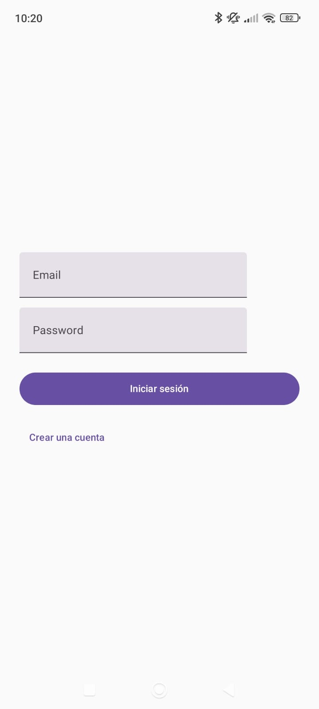
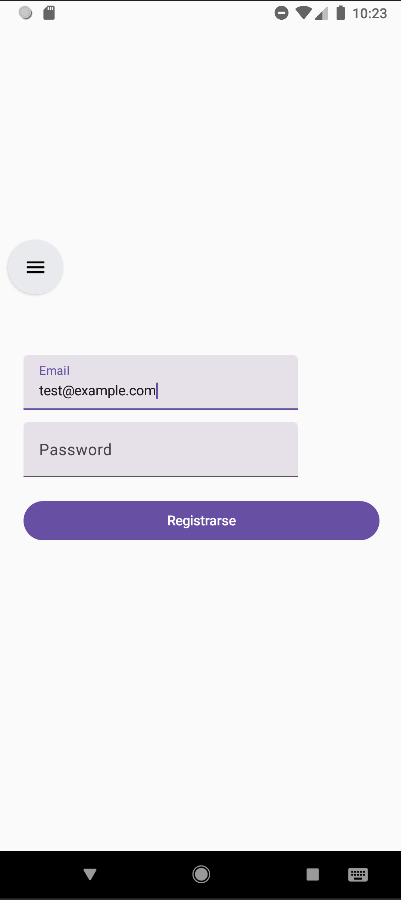
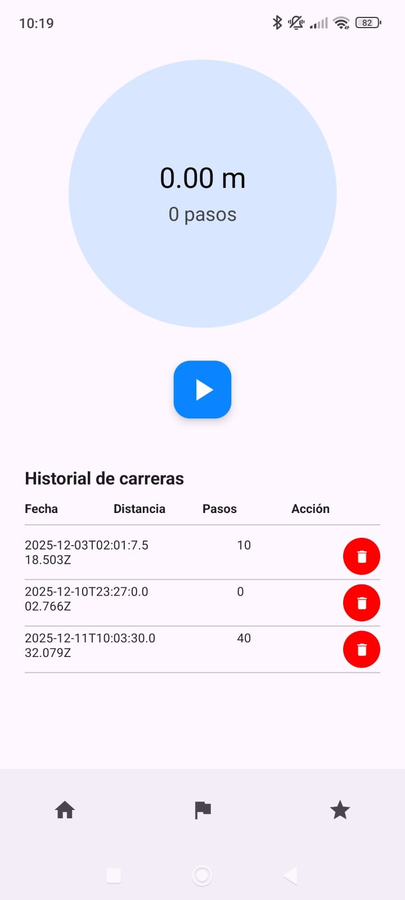
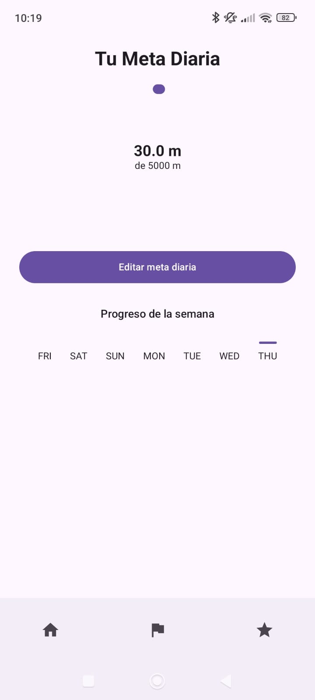
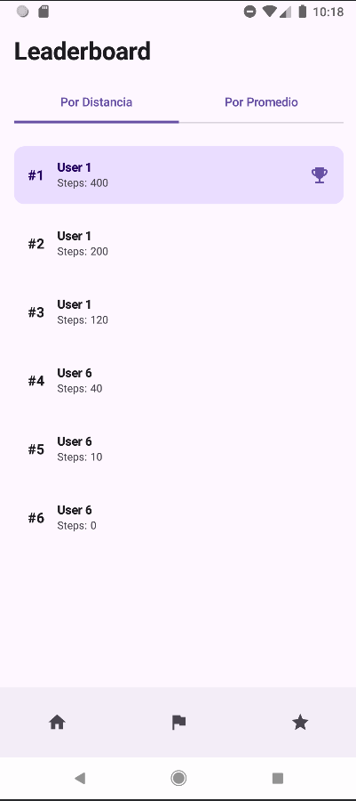
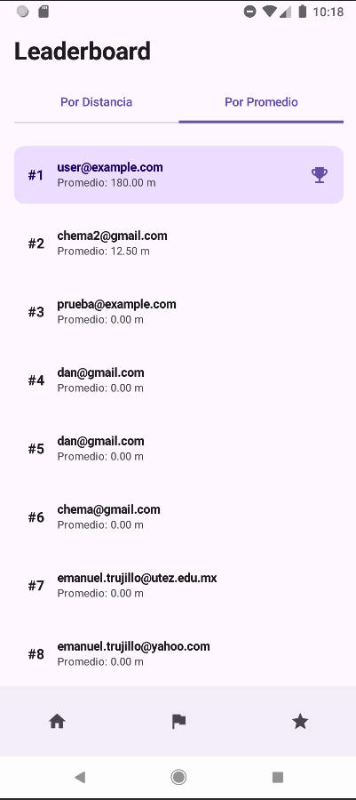

# 📱 GoFit — App de Actividad Física
*Seguimiento de pasos · Metas diarias · Leaderboard · Acelerómetro · Jetpack Compose*
## 👥 Equipo de Desarrollo

- Carlos Emanuel Salgado Trujillo
- Jose María Domínguez Bringas
- Daniel Duran Torres

## 📌 Descripción del Proyecto

GoFit es una aplicación móvil nativa para Android desarrollada completamente en Kotlin utilizando Jetpack Compose y la arquitectura MVVM.

Su propósito es ayudar a los usuarios a mantener un estilo de vida activo mediante el seguimiento de pasos y el establecimiento de metas diarias personalizables.

La app utiliza el sensor del acelerómetro del dispositivo para detectar los pasos del usuario, y se conecta a un backend en Ruby on Rails a través de Retrofit para almacenar y consultar sus métricas de actividad.

## 🚀 Características Principales
### 🏃 Seguimiento de Pasos

- Medición de pasos en tiempo real usando el acelerómetro.
- Conversión a distancia recorrida.
- Registro automático mediante sesiones de actividad.

### 🎯 Metas Diarias

- Meta diaria generada al crear la cuenta.
- Las metas pueden editarse desde la aplicación.
- Visualización del progreso mediante gráficas y porcentajes.

### 🏆 Leaderboard

Dos tablas de clasificación:

- Por distancia recorrida total.
- Por promedio de distancia.

## 🔄 API REST (Backend Ruby on Rails)

La app realiza operaciones CRUD completas mediante Retrofit:

*GET*: consultar metas diarias y sesiones.
*POST*: registrar nuevas sesiones de pasos.
*PUT/PATCH*: editar la meta diaria.
*DELETE*: eliminar sesiones.

## 🛠️ Tecnologías Utilizadas
### Frontend (Android)

- Kotlin

- Jetpack Compose

- MVVM

- ViewModel

- StateFlow / LiveData

- Retrofit + Gson
- Sensores (Acelerómetro)

### Backend

- Ruby on Rails

- PostgreSQL

- Fly Deployment

```
📂 Estructura del Proyecto (Android)
/app
├── java/mx/edu/utez/gofit
│ ├── controller
│ │ ├── AccelerometerManager.kt
│ │ └── NavigationController.kt
│ ├── data
│ │ └── UserPreferences.kt
│ ├── model
│ │ ├── AuthResponse.kt
│ │ ├── AverageDistanceResponse.kt
│ │ ├── DailyGoalResponse.kt
│ │ ├── LeaderboardItemResponse.kt
│ │ ├── LoginRequest.kt
│ │ ├── RegisterRequest.kt
│ │ ├── RegisterRunSessionRequest.kt
│ │ ├── RunSessionResponse.kt
│ │ └── UpdateDailyGoalRequest.kt
│ ├── network
│ │ ├── AuthApi.kt
│ │ ├── AuthInterceptor.kt
│ │ ├── GoalsApi.kt
│ │ ├── LeaderboardApi.kt
│ │ ├── RetrofitClient.kt
│ │ └── RunSessionsApi.kt
│ ├── repository
│ │ └── (repositorio: DailyGoalsRepository, RunSessionsRepository, LeaderboardRepository, etc.)
│ ├── ui
│ │ ├── components
│ │ ├── navigation
│ │ ├── screens
│ │ └── theme
│ ├── viewmodel
│ │ ├── factory
│ │ ├── AccelerometerViewModel.kt
│ │ ├── AuthViewModel.kt
│ │ ├── DailyGoalViewModel.kt
│ │ ├── LeaderboardViewModel.kt
│ │ └── RunSessionsViewModel.kt
│ ├── AppContainer.kt
│ └── MainActivity.kt
└── res

```
## 🧪 Integración con Sensores

La aplicación utiliza el acelerómetro para detectar movimiento y contar pasos.

Características técnicas:

- Lectura continua del sensor
- Filtro de ruido de aceleración
- Cálculo de pasos a partir de variaciones en los ejes X/Y/Z
- Sincronización con la API para registrar sesiones

## 📤 Releases

En la sección Releases del repositorio se encuentra el archivo:

`app-release.apk` — versión firmada lista para instalar.

## 📸 Capturas de Pantalla







